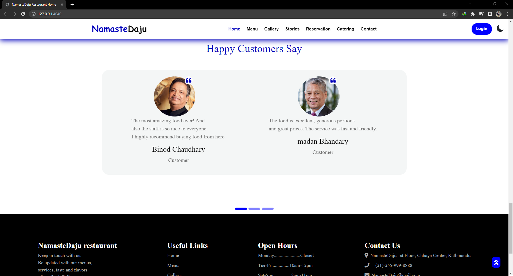

A web app for restaurants in django with MySql.

# Features
1. View restaurant home page and know about the restaurant
2. View restaurant menus
3. Order food 
4. Add food to cart
5. Update profile information
6. View restaurant galleries
7. View restaurant stories
8. Book table
9. Order Catering
10. View restaurant contact information

# Screenshots

